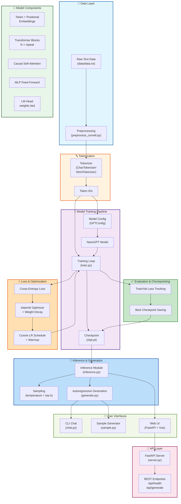
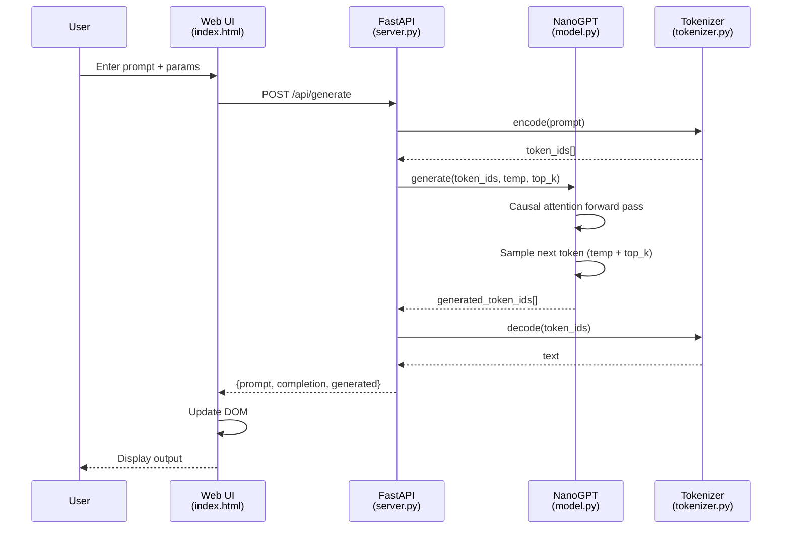

# NanoChat-X: End-to-End Flow & Technologies

## Architecture Overview



## Technology Stack

### **Core ML/AI**
- **PyTorch** – Neural network framework, auto-differentiation, CUDA support
- **NumPy** – Numerical operations, array handling

### **Model Architecture**
- **Causal Transformer** (decoder-only, GPT-style)
  - Multi-head self-attention with causal masking
  - Pre-LayerNorm residual blocks
  - 4× MLP expansion
  - Weight-tied embeddings and LM head

### **Tokenization**
- **CharTokenizer** (default) – Character-level, fully reversible
- **WordTokenizer** – Word-level with `<unk>` fallback

### **Training & Optimization**
- **AdamW optimizer** with weight decay groups
- **Gradient clipping** and accumulation
- **Automatic Mixed Precision (AMP)** on CUDA
- **Warmup + Cosine LR decay** schedule
- **Distributed training-ready** checkpoint system

### **Data Handling**
- **Corpus** class – contiguous batch sampling from train/val split
- **CSV logging** for loss tracking and analysis

### **Web Stack (Optional)**
- **FastAPI** – Python async web framework
- **Uvicorn** – ASGI server
- **Pydantic** – Request/response validation
- **USWDS** – US Web Design System (CSS)
- **Vanilla JavaScript** – Client-side interaction (no build step)
- **Montserrat font** – System font fallback via USWDS

### **Testing & Development**
- **pytest** – Unit testing framework
- **Causal mask property tests** – No future-leak validation

## Project Structure

```
NanoChat-X/
├── src/                        # Core implementation
│   ├── model.py               # NanoGPT transformer architecture
│   ├── config.py              # GPTConfig, TrainConfig dataclasses
│   ├── tokenizer.py           # CharTokenizer, WordTokenizer
│   ├── data.py                # Corpus, batch sampling
│   ├── train.py               # Training loop, checkpoint save/resume
│   ├── inference.py           # Model loading for inference
│   ├── sample.py              # One-shot text generation
│   ├── chat.py                # Interactive prompt-completion loop
│   ├── server.py              # FastAPI web server
│   └── preprocess_cornell.py  # Dataset preprocessing
├── tests/
│   └── test_nanochat.py       # Shape, tokenizer, causal mask tests
├── web/                        # Single-page web console
│   ├── index.html             # Accessible HTML5 structure
│   ├── app.js                 # Fetch API, form handling, live updates
│   └── styles.css             # USWDS tokens, responsive grid
├── utils/
│   └── helpers.py             # Cosine LR, logging, CSV utilities
├── data/
│   ├── data.txt               # Training corpus
│   └── cornell_movie_dialogs/ # Optional: raw conversation data
├── requirements.txt           # torch, numpy, pytest, fastapi, uvicorn, pydantic
├── README.md
└── ARCHITECTURE.md
```

## Key Workflows

### 1. **Training**
```
Text Data → Tokenization → Token IDs → Batches → Forward Pass → Loss → Backprop → Weight Update → Checkpoint
```

### 2. **Generation (Inference)**
```
Checkpoint Load → Model + Tokenizer Init → Prompt Encode → Generate Loop (temp + top-k) → Decode → Output
```

### 3. **Web UI**
```
User Input → FastAPI Endpoint → Model.generate() → JSON Response → DOM Update → Display
```

## End-to-End Data Flow



## Commands

```bash
# Training
python -m src.train --max_iters 3000 --n_layer 6
python -m src.train --tokenizer word --block_size 64
python -m src.train --resume  # continue from checkpoint

# Inference
python -m src.sample --prompt "The thing is " --max_new_tokens 200
python -m src.chat  # Interactive loop

# Web Server
python -m src.server --port 8000
python -m src.server --port 8080 --ckpt out/ckpt.pt

# Testing
python -m pytest -q

# Data Preprocessing (optional)
python -m src.preprocess_cornell  # Prepare Cornell Movie Dialogs
```

## Quick Start

```bash
# 1. Install dependencies
pip install -r requirements.txt

# 2. Train a model (generates out/ckpt.pt)
python -m src.train --max_iters 3000 --n_layer 6 --n_embd 256

# 3. Generate text
python -m src.sample --prompt "The thing is " --top_k 40

# 4. Or run the web UI
python -m src.server
# Open http://127.0.0.1:8000
```